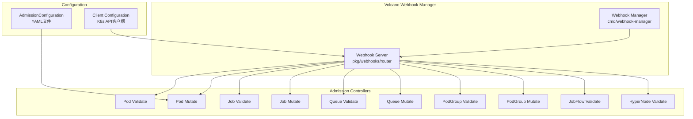
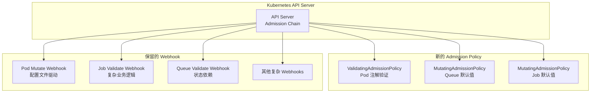

# Volcano Webhook 迁移到 ValidatingAdmissionPolicy 和 MutatingAdmissionPolicy 分析文档

## 概述

本文档详细分析了 Volcano 项目中现有的 admission webhook 实现，并评估将它们迁移到 Kubernetes 1.26+ 引入的 ValidatingAdmissionPolicy 和 MutatingAdmissionPolicy 的可行性。

## 当前 Webhook 架构



## 现有 Webhook 详细分析

### 1. Validating Webhooks (验证 Webhook)

#### 1.1 Pod Validate (`/pods/validate`)
- **资源类型**: `pods` (core/v1)
- **操作**: CREATE
- **功能描述**: 验证 Pod 的预算注解配置
- **核心逻辑**:
  - 仅对使用 Volcano 调度器的 Pod 进行验证
  - 验证 `volcano.sh/jdb-min-available` 和 `volcano.sh/jdb-max-unavailable` 注解
  - 确保不会同时配置两个注解
  - 验证注解值为正整数或有效百分比 (1%-99%)

**验证规则**:
```go
// 检查调度器名称
if !slices.Contains(config.SchedulerNames, pod.Spec.SchedulerName) {
    return ""  // 不验证非Volcano调度的Pod
}

// 验证预算注解
keys := []string{
    vcv1beta1.JDBMinAvailable,      // "volcano.sh/jdb-min-available"
    vcv1beta1.JDBMaxUnavailable,    // "volcano.sh/jdb-max-unavailable"
}
```

#### 1.2 Job Validate (`/jobs/validate`)
- **资源类型**: `jobs` (batch.volcano.sh/v1alpha1)
- **操作**: CREATE, UPDATE
- **功能描述**: 验证 Volcano Job 规范的完整性和正确性
- **核心逻辑**:
  - 验证 Job 任务配置的唯一性
  - 验证资源限制和请求
  - 验证插件兼容性 (MPI, PyTorch, TensorFlow等)
  - 验证生命周期事件和策略
  - 验证容器规范

**复杂验证示例**:
```go
// 验证任务名称唯一性
taskNames := make(map[string]struct{})
for _, task := range job.Spec.Tasks {
    if _, found := taskNames[task.Name]; found {
        return fmt.Errorf("duplicated task name %s", task.Name)
    }
    taskNames[task.Name] = struct{}{}
}

// 验证插件配置
if vcjob.IsDistributedMLFWJob(job) {
    return pluginvalidate.ValidateDistributedMLFWJobSpec(job)
}
```

#### 1.3 Queue Validate (`/queues/validate`)
- **资源类型**: `queues` (scheduling.volcano.sh/v1beta1)
- **操作**: CREATE, UPDATE, DELETE
- **功能描述**: 验证队列层次结构和配置
- **核心逻辑**:
  - 验证队列权重配置
  - 验证分层队列结构
  - 验证队列删除时的依赖关系
  - 验证队列能力配置

#### 1.4 PodGroup Validate (`/podgroups/validate`)
- **资源类型**: `podgroups` (scheduling.volcano.sh/v1beta1)
- **操作**: CREATE
- **功能描述**: 验证 PodGroup 规范
- **核心逻辑**:
  - 验证关联队列的状态
  - 确保队列存在且处于开放状态

#### 1.5 JobFlow Validate (`/jobflows/validate`)
- **资源类型**: `jobflows` (flow.volcano.sh/v1alpha1)
- **操作**: CREATE, UPDATE
- **功能描述**: 验证 JobFlow DAG (有向无环图) 结构
- **核心逻辑**:
  - 验证作业流依赖关系
  - 确保依赖图为 DAG，无环路
  - 验证依赖顶点存在

#### 1.6 HyperNode Validate (`/hypernodes/validate`)
- **资源类型**: `hypernodes` (topology.volcano.sh/v1alpha1)
- **操作**: CREATE, UPDATE
- **功能描述**: 验证节点拓扑和成员选择器
- **核心逻辑**:
  - 验证成员选择器的唯一性
  - 验证正则表达式语法
  - 验证标签选择器格式

### 2. Mutating Webhooks (变更 Webhook)

#### 2.1 Pod Mutate (`/pods/mutate`)
- **资源类型**: `pods` (core/v1)
- **操作**: CREATE
- **功能描述**: 根据配置文件动态修改 Pod 规范
- **核心逻辑**:
  - 基于资源组配置添加节点选择器
  - 添加亲和性配置
  - 添加容忍性配置
  - 设置调度器名称

**变更操作**:
```go
// JSON Patch 操作
type patchOperation struct {
    Op    string      `json:"op"`
    Path  string      `json:"path"`
    Value interface{} `json:"value,omitempty"`
}

// 添加节点选择器
patch = append(patch, patchOperation{
    Op: "add", 
    Path: "/spec/nodeSelector", 
    Value: nodeSelector
})
```

#### 2.2 Job Mutate (`/jobs/mutate`)
- **资源类型**: `jobs` (batch.volcano.sh/v1alpha1)
- **操作**: CREATE
- **功能描述**: 设置 Job 默认值和分布式框架配置
- **核心逻辑**:
  - 设置默认队列 ("default")
  - 设置默认重试次数 (3)
  - 配置分布式训练框架 (MPI, PyTorch, TensorFlow)
  - 设置默认调度器

#### 2.3 Queue Mutate (`/queues/mutate`)
- **资源类型**: `queues` (scheduling.volcano.sh/v1beta1)
- **操作**: CREATE
- **功能描述**: 设置队列默认值和层次结构
- **核心逻辑**:
  - 自动添加 "root" 前缀到分层队列
  - 设置默认权重 (1)
  - 设置默认可回收性 (true)

#### 2.4 PodGroup Mutate (`/podgroups/mutate`)
- **资源类型**: `podgroups` (scheduling.volcano.sh/v1beta1)
- **操作**: CREATE
- **功能描述**: 根据命名空间注解设置队列
- **核心逻辑**:
  - 从命名空间注解中读取队列配置
  - 自动设置 PodGroup 队列

## 迁移可行性分析

### 可以迁移的 Webhook

#### ✅ 1. Queue Mutate - 高度可行
**原因**: 简单的默认值设置和字符串操作

**MutatingAdmissionPolicy 示例**:
```yaml
apiVersion: admissionregistration.k8s.io/v1beta1
kind: MutatingAdmissionPolicy
metadata:
  name: volcano-queue-defaults
spec:
  reinvocationPolicy: None
  matchConstraints:
    resourceRules:
    - operations: ["CREATE"]
      apiGroups: ["scheduling.volcano.sh"]
      apiVersions: ["v1beta1"] 
      resources: ["queues"]
  mutations:
  - patchType: "JSONPatch"
    jsonPatch:
      expression: |
        [
          if has(object.spec.weight) && object.spec.weight == 0 then
            {"op": "add", "path": "/spec/weight", "value": 1} 
          else null,
          if !has(object.spec.reclaimable) then
            {"op": "add", "path": "/spec/reclaimable", "value": true}
          else null,
          if has(object.metadata.annotations) && 
             has(object.metadata.annotations["scheduling.volcano.sh/queue-hierarchy"]) &&
             !startsWith(object.metadata.annotations["scheduling.volcano.sh/queue-hierarchy"], "root") then
            {"op": "replace", 
             "path": "/metadata/annotations/scheduling.volcano.sh~1queue-hierarchy", 
             "value": "root/" + object.metadata.annotations["scheduling.volcano.sh/queue-hierarchy"]}
          else null
        ].filter(x, x != null)
```

#### ✅ 2. Job Mutate - 中等可行
**原因**: 主要是默认值设置，部分复杂逻辑可以简化

**MutatingAdmissionPolicy 示例**:
```yaml
apiVersion: admissionregistration.k8s.io/v1beta1
kind: MutatingAdmissionPolicy
metadata:
  name: volcano-job-defaults
spec:
  reinvocationPolicy: None
  matchConstraints:
    resourceRules:
    - operations: ["CREATE"]
      apiGroups: ["batch.volcano.sh"]
      apiVersions: ["v1alpha1"]
      resources: ["jobs"]
  mutations:
  - patchType: "JSONPatch"
    jsonPatch:
      expression: |
        [
          if !has(object.spec.queue) || object.spec.queue == "" then
            {"op": "add", "path": "/spec/queue", "value": "default"}
          else null,
          if !has(object.spec.maxRetry) || object.spec.maxRetry == 0 then
            {"op": "add", "path": "/spec/maxRetry", "value": 3}
          else null,
          if !has(object.spec.schedulerName) || object.spec.schedulerName == "" then
            {"op": "add", "path": "/spec/schedulerName", "value": "volcano"}
          else null
        ].filter(x, x != null)
```

#### ✅ 3. Pod Validate (部分) - 中等可行
**原因**: 注解验证逻辑可以用 CEL 表达式实现

**ValidatingAdmissionPolicy 示例**:
```yaml
apiVersion: admissionregistration.k8s.io/v1beta1
kind: ValidatingAdmissionPolicy
metadata:
  name: volcano-pod-budget-validation
spec:
  matchConstraints:
    resourceRules:
    - operations: ["CREATE"]
      apiGroups: [""]
      apiVersions: ["v1"] 
      resources: ["pods"]
    objectSelector:
      matchExpressions:
      - key: spec.schedulerName
        operator: In
        values: ["volcano"]
  validations:
  - expression: |
      !(
        has(object.metadata.annotations) && 
        has(object.metadata.annotations["volcano.sh/jdb-min-available"]) &&
        has(object.metadata.annotations["volcano.sh/jdb-max-unavailable"])
      )
    message: "不允许同时配置 jdb-min-available 和 jdb-max-unavailable 注解"
  - expression: |
      !has(object.metadata.annotations) || 
      !has(object.metadata.annotations["volcano.sh/jdb-min-available"]) ||
      (
        object.metadata.annotations["volcano.sh/jdb-min-available"].matches(r'^[1-9]\d*$') ||
        object.metadata.annotations["volcano.sh/jdb-min-available"].matches(r'^([1-9]\d?|[1-9])%$')
      )
    message: "jdb-min-available 必须是正整数或1%-99%的百分比"
  - expression: |
      !has(object.metadata.annotations) || 
      !has(object.metadata.annotations["volcano.sh/jdb-max-unavailable"]) ||
      (
        object.metadata.annotations["volcano.sh/jdb-max-unavailable"].matches(r'^[1-9]\d*$') ||
        object.metadata.annotations["volcano.sh/jdb-max-unavailable"].matches(r'^([1-9]\d?|[1-9])%$')
      )
    message: "jdb-max-unavailable 必须是正整数或1%-99%的百分比"
```

### 难以迁移的 Webhook

#### ❌ 1. Pod Mutate - 迁移困难
**原因**:
- 依赖外部配置文件 (AdmissionConfiguration)
- 需要动态资源组匹配
- 复杂的亲和性 JSON 解析
- 不支持动态配置更新

**限制因素**:
```go
// 当前实现依赖外部配置
for _, resourceGroup := range config.ConfigData.ResGroupsConfig {
    group := GetResGroup(resourceGroup)
    if !group.IsBelongResGroup(pod, resourceGroup) {
        continue
    }
    // 动态应用配置...
}
```

#### ❌ 2. Job Validate - 迁移困难  
**原因**:
- 复杂的任务验证逻辑
- 插件兼容性检查
- 分布式训练框架验证
- 需要深度嵌套对象验证

**复杂逻辑示例**:
```go
// 验证分布式训练作业
if vcjob.IsDistributedMLFWJob(job) {
    return pluginvalidate.ValidateDistributedMLFWJobSpec(job)
}

// 验证任务唯一性
taskNames := make(map[string]struct{})
for _, task := range job.Spec.Tasks {
    if _, found := taskNames[task.Name]; found {
        return fmt.Errorf("duplicated task name %s", task.Name)
    }
}
```

#### ❌ 3. Queue Validate - 迁移困难
**原因**:
- 需要访问 QueueLister 获取现有队列状态
- 复杂的层次结构验证
- 跨对象依赖检查

**外部依赖示例**:
```go
// 需要访问集群状态
queue, err := config.QueueLister.Get(queueName)
if err != nil {
    return fmt.Errorf("failed to get queue %s: %v", queueName, err)
}
```

#### ❌ 4. PodGroup Mutate - 迁移困难
**原因**:
- 需要查询命名空间对象
- 依赖 Kubernetes API 客户端

**API 调用示例**:
```go
// 需要 API 调用获取命名空间
ns, err := config.KubeClient.CoreV1().Namespaces().Get(context.TODO(), 
    podgroup.Namespace, metav1.GetOptions{})
```

#### ❌ 5. JobFlow Validate - 迁移困难
**原因**:
- 复杂的 DAG 验证算法
- 需要图论算法实现
- CEL 不支持复杂循环和递归

#### ❌ 6. HyperNode Validate - 迁移困难
**原因**:
- 复杂的成员选择器验证
- 多种匹配模式的互斥验证
- 正则表达式编译验证

## 迁移策略建议

### 阶段 1: 简单 Webhook 迁移 (立即可行)

#### 1.1 Queue Mutate 完全迁移
创建对应的 MutatingAdmissionPolicy，逐步停用原 webhook。

#### 1.2 Job Mutate 部分迁移  
迁移默认值设置部分，保留复杂的分布式框架配置逻辑。

### 阶段 2: 中等复杂度 Webhook 部分迁移

#### 2.1 Pod Validate 部分迁移
迁移注解验证逻辑，保持调度器过滤功能。

### 阶段 3: 复杂 Webhook 保持现状

对于以下 webhook，建议保持现有实现:
- Pod Mutate (配置文件依赖)
- Job Validate (复杂业务逻辑) 
- Queue Validate (外部状态依赖)
- PodGroup Mutate (API 调用依赖)
- JobFlow Validate (算法复杂性)
- HyperNode Validate (多重验证逻辑)

### 混合部署策略



## 实施步骤

### 步骤 1: 环境准备
1. 确保 Kubernetes 集群版本 ≥ 1.26
2. 启用 ValidatingAdmissionPolicy 和 MutatingAdmissionPolicy 功能门控
3. 创建测试命名空间和资源

### 步骤 2: 创建 Admission Policy

#### 2.1 创建 ValidatingAdmissionPolicyBinding
```yaml
apiVersion: admissionregistration.k8s.io/v1beta1
kind: ValidatingAdmissionPolicyBinding
metadata:
  name: volcano-pod-budget-validation-binding
spec:
  policyName: volcano-pod-budget-validation
  validationActions: [Warn, Deny]
  matchResources:
    namespaceSelector: {}
```

#### 2.2 创建 MutatingAdmissionPolicyBinding
```yaml
apiVersion: admissionregistration.k8s.io/v1beta1
kind: MutatingAdmissionPolicyBinding  
metadata:
  name: volcano-queue-defaults-binding
spec:
  policyName: volcano-queue-defaults
  matchResources:
    namespaceSelector: {}
```

### 步骤 3: 测试验证
1. 创建测试 Pod 验证注解验证逻辑
2. 创建测试 Queue 验证默认值设置
3. 创建测试 Job 验证默认配置

### 步骤 4: 逐步迁移
1. 在测试环境部署新的 Admission Policy
2. 并行运行新旧系统，对比结果
3. 逐步在生产环境启用新策略
4. 停用对应的原有 webhook

## 性能影响分析

### 优势
- **性能提升**: CEL 表达式比 HTTP 调用更快
- **资源消耗**: 减少 webhook 服务器资源使用
- **延迟降低**: 避免网络往返时间

### 挑战  
- **表达式复杂度**: 复杂的 CEL 表达式可能影响性能
- **调试困难**: CEL 表达式错误诊断相对困难
- **功能限制**: 某些复杂逻辑无法实现

## 监控和故障排除

### 监控指标
- Admission Policy 执行延迟
- 策略拒绝率和错误率
- CEL 表达式执行时间

### 故障排除
```bash
# 查看 Admission Policy 状态
kubectl get validatingadmissionpolicies
kubectl get mutatingadmissionpolicies

# 查看策略绑定状态
kubectl get validatingadmissionpolicybindings
kubectl get mutatingadmissionpolicybindings

# 查看审核日志
kubectl logs -n kube-system -l component=kube-apiserver | grep -i admission
```

## 总结

Volcano 项目的 webhook 迁移到新的 Admission Policy 需要分阶段、有选择地进行:

1. **简单默认值设置**: 可以完全迁移
2. **基础验证逻辑**: 可以部分迁移  
3. **复杂业务逻辑**: 建议保持现有实现

这种混合策略既能享受新特性的好处，又能保持现有功能的完整性。建议从简单的 Queue Mutate 和 Job Mutate 开始迁移，积累经验后再考虑更复杂的场景。

## 参考资料

- [Kubernetes ValidatingAdmissionPolicy 文档](https://kubernetes.io/zh-cn/docs/reference/access-authn-authz/validating-admission-policy/)
- [Kubernetes MutatingAdmissionPolicy 文档](https://kubernetes.io/zh-cn/docs/reference/access-authn-authz/mutating-admission-policy/)  
- [CEL 表达式语言指南](https://kubernetes.io/zh-cn/docs/reference/using-api/cel/)
- [Volcano 项目 GitHub 仓库](https://github.com/volcano-sh/volcano)