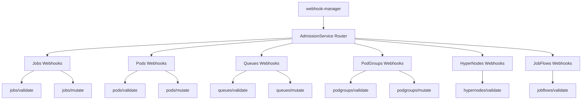
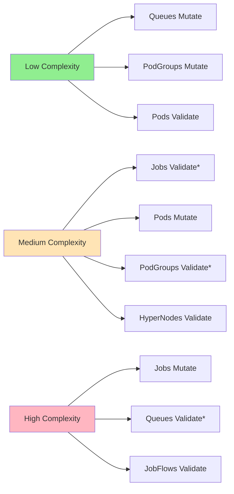
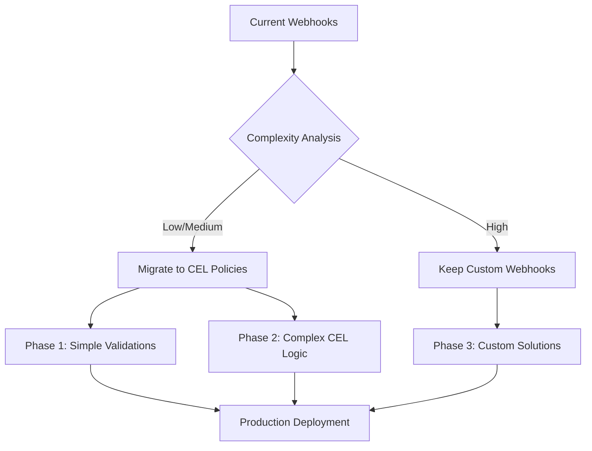

# Volcano Webhooks Migration Analysis

## Overview

This document provides a comprehensive analysis of the existing admission webhooks in the Volcano project and their potential migration to ValidatingAdmissionPolicy and MutatingAdmissionPolicy using CEL expressions.

Volcano currently implements 10 admission webhooks across 6 resource types:

- **Jobs** (batch.volcano.sh/v1alpha1)
- **Pods** (core/v1) 
- **Queues** (scheduling.volcano.sh/v1beta1)
- **PodGroups** (scheduling.volcano.sh/v1beta1)
- **HyperNodes** (topology.volcano.sh/v1alpha1)
- **JobFlows** (flow.volcano.sh/v1alpha1)

## Webhook Architecture



## Detailed Webhook Analysis

### 1. Jobs Validation Webhook

**Path:** `/jobs/validate`  
**Operations:** CREATE, UPDATE  
**Resources:** batch.volcano.sh/v1alpha1/jobs  

**Current Functionality:**

**Jobs Validate Webhook** validates Volcano Job resources during CREATE and UPDATE operations:

- **MinAvailable validation**: Ensures `spec.minAvailable >= 0`
- **MaxRetry validation**: Ensures `spec.maxRetry >= 0`
- **TTL validation**: Ensures `spec.ttlSecondsAfterFinished >= 0` if set
- **Task validation**: Ensures at least one task is defined
- **Task name uniqueness**: Validates unique task names
- **Replica validation**: Ensures MinAvailable ≤ total replicas across tasks
- **Policy validation**: Validates job lifecycle policies and events
- **Plugin validation**: Validates specified job plugins exist
- **Volume validation**: Validates I/O volumes configuration
- **Queue validation**: Validates target queue exists and is in "Open" state
- **Hierarchical queue validation**: Prevents submission to non-leaf queues

**CEL Migration Complexity**: 🟡 **Medium** - Most validations can be converted to CEL, but queue state checking and plugin validation require external lookups.

### 2. Jobs Mutation Webhook

**Path:** `/jobs/mutate`  
**Operations:** CREATE  
**Resources:** batch.volcano.sh/v1alpha1/jobs  

**Current Functionality:**

**Jobs Mutate Webhook** applies default values to Job resources during CREATE:

- **Default Queue**: Sets `spec.queue = "default"` if empty
- **Default Scheduler**: Sets `spec.schedulerName` using generator if empty  
- **Default MaxRetry**: Sets `spec.maxRetry = 3` if zero
- **Default MinAvailable**: Calculates from tasks if zero
- **Default Plugins**: Adds distributed framework plugins for MPI/PyTorch/TensorFlow
- **Task Mutations**: Applies defaults to task specifications

**CEL Migration Complexity**: 🔴 **High** - Default value mutations require complex CEL logic and scheduler name generation.

### 3. Pods Validation Webhook  

**Path:** `/pods/validate`  
**Operations:** CREATE  
**Resources:** core/v1/pods

**Current Functionality:**

**Pods Validate Webhook** validates Pod resources:

- **Scheduler validation**: Only validates pods using Volcano scheduler
- **Budget annotations**: Validates pod budget configuration annotations
- **Resource requirements**: Validates pod resource specifications

**CEL Migration Complexity**: 🟢 **Low** - Simple validation rules easily converted to CEL.

### 4. Pods Mutation Webhook

**Path:** `/pods/mutate`  
**Operations:** CREATE  
**Resources:** core/v1/pods

**Current Functionality:**

**Pods Mutate Webhook** applies mutations to Pod resources:

- **Scheduler assignment**: Sets schedulerName for Volcano-managed pods
- **Annotation defaults**: Adds default Volcano annotations
- **Resource defaults**: Applies default resource configurations

**CEL Migration Complexity**: 🟡 **Medium** - Conditional mutations based on existing annotations.

### 5. Queues Validation Webhook

**Path:** `/queues/validate`  
**Operations:** CREATE, UPDATE, DELETE  
**Resources:** scheduling.volcano.sh/v1beta1/queues

**Current Functionality:**

**Queues Validate Webhook** validates Queue resources:

- **State validation**: Validates queue state transitions
- **Weight validation**: Ensures valid queue weight values
- **Hierarchical validation**: Validates parent-child queue relationships
- **Deletion protection**: Prevents deletion of "default" and "root" queues
- **Child queue validation**: Ensures no active child queues when deleting

**CEL Migration Complexity**: 🔴 **High** - Requires complex hierarchical relationship validation and external queue lookups.

### 6. Queues Mutation Webhook

**Path:** `/queues/mutate`  
**Operations:** CREATE  
**Resources:** scheduling.volcano.sh/v1beta1/queues  

**Current Functionality:**

**Queues Mutate Webhook** applies defaults to Queue resources:

- **Default weight**: Sets default weight if not specified
- **State initialization**: Sets initial queue state
- **Capability defaults**: Adds default queue capabilities

**CEL Migration Complexity**: 🟢 **Low** - Simple default value assignment.

### 7. PodGroups Validation Webhook

**Path:** `/podgroups/validate`  
**Operations:** CREATE  
**Resources:** scheduling.volcano.sh/v1beta1/podgroups

**Current Functionality:**

**PodGroups Validate Webhook** validates PodGroup resources:

- **Replica validation**: Validates minMember configuration
- **Queue validation**: Validates target queue exists
- **Priority validation**: Validates priority class settings

**CEL Migration Complexity**: 🟡 **Medium** - Requires queue existence validation.

### 8. PodGroups Mutation Webhook

**Path:** `/podgroups/mutate`  
**Operations:** CREATE  
**Resources:** scheduling.volcano.sh/v1beta1/podgroups

**Current Functionality:**

**PodGroups Mutate Webhook** applies defaults to PodGroup resources:

- **Default queue**: Sets default queue if not specified
- **Default priority**: Sets default priority class
- **Scheduler assignment**: Sets default scheduler name

**CEL Migration Complexity**: 🟢 **Low** - Simple default value assignment.

### 9. HyperNodes Validation Webhook

**Path:** `/hypernodes/validate`  
**Operations:** CREATE, UPDATE  
**Resources:** topology.volcano.sh/v1alpha1/hypernodes

**Current Functionality:**

**HyperNodes Validate Webhook** validates HyperNode resources for topology-aware scheduling:

- **Topology validation**: Validates node topology information
- **Resource validation**: Validates hypernode resource specifications
- **Attribute validation**: Validates hypernode attributes and labels

**CEL Migration Complexity**: 🟡 **Medium** - Topology validation rules can be converted to CEL.

### 10. JobFlows Validation Webhook

**Path:** `/jobflows/validate`  
**Operations:** CREATE, UPDATE  
**Resources:** flow.volcano.sh/v1alpha1/jobflows

**Current Functionality:**

**JobFlows Validate Webhook** validates JobFlow DAG resources:

- **DAG validation**: Validates directed acyclic graph structure
- **Dependency validation**: Ensures no circular dependencies
- **Flow validation**: Validates individual flow specifications
- **Target validation**: Validates dependency targets exist

**CEL Migration Complexity**: 🔴 **High** - Complex graph validation requiring sophisticated CEL logic.

## Migration Strategy and Recommendations

### Migration Priority Matrix



*Webhooks requiring external resource lookups

### Phase 1: Low Complexity Migrations (Quick Wins)

#### 1. Queues Mutate Webhook → MutatingAdmissionPolicy

```yaml
apiVersion: admissionregistration.k8s.io/v1beta1
kind: MutatingAdmissionPolicy
metadata:
  name: volcano-queues-defaults
spec:
  matchResources:
    resourceRules:
    - apiGroups: ["scheduling.volcano.sh"]
      apiVersions: ["v1beta1"]
      resources: ["queues"]
      operations: ["CREATE"]
  mutations:
  - patchType: "JSONPatch"
    jsonPatch:
      expression: |
        [
          has(object.spec.weight) ? {} : {"op": "add", "path": "/spec/weight", "value": 1},
          has(object.spec.capability) ? {} : {"op": "add", "path": "/spec/capability", "value": {}}
        ].filter(p, size(p) > 0)
```

#### 2. PodGroups Mutate Webhook → MutatingAdmissionPolicy  

```yaml
apiVersion: admissionregistration.k8s.io/v1beta1
kind: MutatingAdmissionPolicy  
metadata:
  name: volcano-podgroups-defaults
spec:
  matchResources:
    resourceRules:
    - apiGroups: ["scheduling.volcano.sh"]
      apiVersions: ["v1beta1"] 
      resources: ["podgroups"]
      operations: ["CREATE"]
  mutations:
  - patchType: "JSONPatch"
    jsonPatch:
      expression: |
        [
          has(object.spec.queue) ? {} : {"op": "add", "path": "/spec/queue", "value": "default"},
          has(object.spec.schedulerName) ? {} : {"op": "add", "path": "/spec/schedulerName", "value": "volcano"}
        ].filter(p, size(p) > 0)
```

#### 3. Pods Validate Webhook → ValidatingAdmissionPolicy

```yaml
apiVersion: admissionregistration.k8s.io/v1beta1
kind: ValidatingAdmissionPolicy
metadata:
  name: volcano-pods-validation
spec:
  matchResources:
    resourceRules:
    - apiGroups: [""]
      apiVersions: ["v1"]
      resources: ["pods"] 
      operations: ["CREATE"]
  validations:
  - expression: |
      object.spec.schedulerName != "volcano" || 
      (has(object.metadata.annotations) && 
       has(object.metadata.annotations["scheduling.volcano.sh/group-name"]))
    message: "Volcano scheduled pods must have group-name annotation"
```

### Phase 2: Medium Complexity Migrations

#### Jobs Validate Webhook → ValidatingAdmissionPolicy

This requires multiple policies due to CEL limitations:

```yaml
apiVersion: admissionregistration.k8s.io/v1beta1
kind: ValidatingAdmissionPolicy
metadata:
  name: volcano-jobs-basic-validation
spec:
  matchResources:
    resourceRules:
    - apiGroups: ["batch.volcano.sh"]
      apiVersions: ["v1alpha1"]
      resources: ["jobs"]
      operations: ["CREATE", "UPDATE"]
  validations:
  - expression: "object.spec.minAvailable >= 0"
    message: "job 'minAvailable' must be >= 0"
  - expression: "object.spec.maxRetry >= 0"  
    message: "'maxRetry' cannot be less than zero"
  - expression: |
      !has(object.spec.ttlSecondsAfterFinished) || 
      object.spec.ttlSecondsAfterFinished >= 0
    message: "'ttlSecondsAfterFinished' cannot be less than zero"
  - expression: "size(object.spec.tasks) > 0"
    message: "job must have at least one task"
  - expression: |
      size(object.spec.tasks) == size(object.spec.tasks.map(t, t.name).unique())
    message: "task names must be unique"
  - expression: |
      object.spec.minAvailable <= object.spec.tasks.map(t, t.replicas).sum()
    message: "'minAvailable' should not be greater than total replicas"
```

### Phase 3: High Complexity Migrations (Require Custom Solutions)

#### Complex Webhooks Requiring Hybrid Approaches

1. **Jobs Mutate Webhook**: Complex default value generation
2. **Queues Validate Webhook**: Hierarchical relationship validation  
3. **JobFlows Validate Webhook**: DAG cycle detection

**Recommended Approach**: Implement using ValidatingAdmissionPolicy/MutatingAdmissionPolicy where possible, maintain custom webhooks for complex logic.

## Implementation Considerations

### CEL Limitations for Volcano Webhooks

1. **External Resource Lookups**: CEL cannot query other Kubernetes resources
2. **Complex Business Logic**: Graph algorithms, complex calculations
3. **Dynamic Default Generation**: Scheduler name generation, complex mutations
4. **Cross-Resource Validation**: Queue-job relationships, hierarchical validations

### Hybrid Migration Strategy



### Benefits of Migration

1. **Performance**: Reduced network latency for simple validations
2. **Reliability**: Built-in Kubernetes admission control reliability
3. **Maintainability**: Declarative policy management
4. **Security**: Reduced attack surface, no custom webhook servers

### Migration Timeline

- **Phase 1** (1-2 months): Low complexity webhooks
- **Phase 2** (2-3 months): Medium complexity with CEL optimization  
- **Phase 3** (3-4 months): Hybrid approach for complex webhooks
- **Total Estimated Duration**: 6-9 months

## Detailed CEL Implementation Examples

### Complex Jobs Validation with Advanced CEL

```yaml
apiVersion: admissionregistration.k8s.io/v1beta1
kind: ValidatingAdmissionPolicy
metadata:
  name: volcano-jobs-advanced-validation
spec:
  matchResources:
    resourceRules:
    - apiGroups: ["batch.volcano.sh"]
      apiVersions: ["v1alpha1"]
      resources: ["jobs"]
      operations: ["CREATE", "UPDATE"]
  validations:
  # Task replica distribution validation
  - expression: |
      object.spec.tasks.all(task, 
        task.replicas > 0 && 
        (task.minAvailable == null || task.minAvailable <= task.replicas)
      )
    message: "Each task must have replicas > 0 and minAvailable <= replicas"
  
  # Policy validation with complex conditions
  - expression: |
      !has(object.spec.policies) || 
      object.spec.policies.all(policy,
        has(policy.event) && 
        policy.event in ['PodEvicted', 'PodFailed', 'TaskCompleted', 'JobUnschedulable'] &&
        has(policy.action) &&
        policy.action in ['AbortJob', 'CompleteJob', 'RestartJob', 'RestartTask', 'TerminateJob']
      )
    message: "Invalid policy event or action specified"
  
  # Volume I/O validation 
  - expression: |
      !has(object.spec.volumes) ||
      object.spec.volumes.all(vol, 
        has(vol.mountPath) && 
        vol.mountPath != '' &&
        !vol.mountPath.startsWith('/') == false
      )
    message: "Volume mountPath must be absolute path"

# Multi-operation validation for Updates
---
apiVersion: admissionregistration.k8s.io/v1beta1
kind: ValidatingAdmissionPolicy
metadata:
  name: volcano-jobs-update-validation
spec:
  matchResources:
    resourceRules:
    - apiGroups: ["batch.volcano.sh"]
      apiVersions: ["v1alpha1"]
      resources: ["jobs"]
      operations: ["UPDATE"]
  validations:
  - expression: |
      oldObject.spec.schedulerName == object.spec.schedulerName
    message: "Cannot modify schedulerName after creation"
  - expression: |
      oldObject.spec.queue == object.spec.queue  
    message: "Cannot modify queue after creation"
  - expression: |
      object.spec.minAvailable >= oldObject.spec.minAvailable
    message: "Cannot decrease minAvailable"
```

### Advanced PodGroup Validation with Queue Integration

```yaml
apiVersion: admissionregistration.k8s.io/v1beta1
kind: ValidatingAdmissionPolicy
metadata:
  name: volcano-podgroups-enhanced-validation
spec:
  matchResources:
    resourceRules:
    - apiGroups: ["scheduling.volcano.sh"]
      apiVersions: ["v1beta1"]
      resources: ["podgroups"]
      operations: ["CREATE"]
  validations:
  - expression: |
      object.spec.minMember > 0 && 
      object.spec.minMember <= (has(object.spec.maxMember) ? object.spec.maxMember : object.spec.minMember)
    message: "minMember must be positive and <= maxMember"
  - expression: |
      !has(object.spec.priorityClassName) || 
      object.spec.priorityClassName.matches('^[a-z0-9]([-a-z0-9]*[a-z0-9])?$')
    message: "Invalid priorityClassName format"
  - expression: |
      !has(object.metadata.annotations) ||
      !has(object.metadata.annotations['scheduling.volcano.sh/queue-name']) ||
      object.metadata.annotations['scheduling.volcano.sh/queue-name'].matches('^[a-z0-9]([-a-z0-9]*[a-z0-9])?$')
    message: "Queue name must follow Kubernetes naming conventions"
```

### JobFlow DAG Validation using CEL

```yaml
apiVersion: admissionregistration.k8s.io/v1beta1
kind: ValidatingAdmissionPolicy
metadata:
  name: volcano-jobflows-dag-validation
spec:
  matchResources:
    resourceRules:
    - apiGroups: ["flow.volcano.sh"]
      apiVersions: ["v1alpha1"]
      resources: ["jobflows"]
      operations: ["CREATE", "UPDATE"]
  validations:
  # Basic DAG structure validation
  - expression: |
      size(object.spec.flows) > 0
    message: "JobFlow must contain at least one flow"
  
  # Flow name uniqueness
  - expression: |
      size(object.spec.flows) == size(object.spec.flows.map(f, f.name).unique())
    message: "Flow names must be unique"
  
  # Dependency target existence
  - expression: |
      object.spec.flows.all(flow,
        !has(flow.dependsOn) || 
        !has(flow.dependsOn.targets) ||
        flow.dependsOn.targets.all(target, 
          target in object.spec.flows.map(f, f.name)
        )
      )
    message: "Dependency targets must reference existing flows"
  
  # Self-dependency prevention
  - expression: |
      object.spec.flows.all(flow,
        !has(flow.dependsOn) || 
        !has(flow.dependsOn.targets) ||
        !(flow.name in flow.dependsOn.targets)
      )
    message: "Flow cannot depend on itself"
  
  # Simple cycle detection (limited depth)
  - expression: |
      object.spec.flows.all(flow,
        !has(flow.dependsOn) || 
        !has(flow.dependsOn.targets) ||
        flow.dependsOn.targets.all(target,
          !object.spec.flows.filter(f, f.name == target)[0].?dependsOn.?targets.orValue([]).exists(t, t == flow.name)
        )
      )
    message: "Circular dependencies detected (direct cycles)"
```

## Migration Tooling and Automation

### Migration Helper Script

```bash
#!/bin/bash
# webhook-migration-helper.sh

VOLCANO_ROOT="/home/runner/work/volcano/volcano"
POLICY_OUTPUT_DIR="./admission-policies"

mkdir -p "$POLICY_OUTPUT_DIR"

echo "🚀 Starting Volcano Webhook Migration Analysis..."

# Extract validation rules from existing webhooks
extract_job_validations() {
    echo "Extracting Job validation rules..."
    
    # Parse existing validation logic
    grep -r "reviewResponse.Allowed = false" "$VOLCANO_ROOT/pkg/webhooks/admission/jobs/validate/" \
        | sed 's/.*return "\(.*\)"/\1/' > "$POLICY_OUTPUT_DIR/job-validation-messages.txt"
    
    # Generate CEL policy template
    cat > "$POLICY_OUTPUT_DIR/jobs-validate-policy.yaml" << 'EOF'
apiVersion: admissionregistration.k8s.io/v1beta1
kind: ValidatingAdmissionPolicy
metadata:
  name: volcano-jobs-validation
  labels:
    migration.volcano.sh/source: "webhook"
    migration.volcano.sh/complexity: "medium"
spec:
  matchResources:
    resourceRules:
    - apiGroups: ["batch.volcano.sh"]
      apiVersions: ["v1alpha1"]
      resources: ["jobs"]
      operations: ["CREATE", "UPDATE"]
  validations:
  # Generated from existing webhook logic
  - expression: "object.spec.minAvailable >= 0"
    message: "job 'minAvailable' must be >= 0"
EOF
}

# Generate migration report
generate_migration_report() {
    echo "📊 Generating migration complexity report..."
    
    cat > "$POLICY_OUTPUT_DIR/migration-report.md" << 'EOF'
# Volcano Webhook Migration Report

## Migration Status by Webhook

| Webhook | Type | LOC | Complexity | CEL Ready | Status |
|---------|------|-----|------------|-----------|--------|
EOF

    # Analyze each webhook directory
    find "$VOLCANO_ROOT/pkg/webhooks/admission" -name "*.go" -path "*/validate/*" -o -path "*/mutate/*" \
        | xargs -I {} sh -c '
            FILE={}
            LINES=$(wc -l < "$FILE")
            TYPE=$(echo "$FILE" | grep -o "mutate\|validate")
            WEBHOOK=$(echo "$FILE" | sed "s|.*/admission/||" | sed "s|/.*||")
            
            # Determine complexity based on lines of code and logic patterns
            if [ $LINES -lt 150 ]; then
                COMPLEXITY="🟢 Low"
                CEL_READY="✅ Yes"
                STATUS="Ready"
            elif [ $LINES -lt 300 ]; then
                COMPLEXITY="🟡 Medium" 
                CEL_READY="⚠️ Partial"
                STATUS="Phase 2"
            else
                COMPLEXITY="🔴 High"
                CEL_READY="❌ No"
                STATUS="Custom"
            fi
            
            echo "| $WEBHOOK | $TYPE | $LINES | $COMPLEXITY | $CEL_READY | $STATUS |"
        ' >> "$POLICY_OUTPUT_DIR/migration-report.md"
}

# Main execution
extract_job_validations
generate_migration_report

echo "✅ Migration analysis complete! Check $POLICY_OUTPUT_DIR/ for results."
```

### Policy Validation Tool

```go
// tools/policy-validator/main.go
package main

import (
    "context"
    "fmt"
    "log"
    
    admissionv1beta1 "k8s.io/api/admissionregistration/v1beta1"
    metav1 "k8s.io/apimachinery/pkg/apis/meta/v1"
    "k8s.io/client-go/kubernetes"
    "sigs.k8s.io/controller-runtime/pkg/client/config"
)

func main() {
    cfg, err := config.GetConfig()
    if err != nil {
        log.Fatal(err)
    }
    
    client, err := kubernetes.NewForConfig(cfg)
    if err != nil {
        log.Fatal(err)
    }
    
    // Validate existing policies
    policies, err := client.AdmissionregistrationV1beta1().
        ValidatingAdmissionPolicies().
        List(context.TODO(), metav1.ListOptions{
            LabelSelector: "migration.volcano.sh/source=webhook",
        })
    
    if err != nil {
        log.Fatal(err)
    }
    
    fmt.Printf("Found %d migrated policies:\n", len(policies.Items))
    for _, policy := range policies.Items {
        fmt.Printf("- %s (complexity: %s)\n", 
            policy.Name, 
            policy.Labels["migration.volcano.sh/complexity"])
    }
}
```

## Testing Strategy for Migrated Policies

### Integration Test Framework

```yaml
# test/integration/admission-policy-test.yaml
apiVersion: v1
kind: Pod
metadata:
  name: policy-test-runner
  namespace: volcano-system
spec:
  containers:
  - name: test-runner
    image: golang:1.21
    command: ["/bin/sh", "-c", "cd /workspace && go test ./test/integration/..."]
    volumeMounts:
    - name: workspace
      mountPath: /workspace
  volumes:
  - name: workspace
    configMap:
      name: test-workspace

---
apiVersion: batch/v1
kind: Job
metadata:
  name: webhook-migration-test
spec:
  template:
    spec:
      containers:
      - name: test
        image: curlimages/curl
        command: 
        - /bin/sh
        - -c
        - |
          # Test job creation with various scenarios
          curl -X POST "$KUBERNETES_API/api/v1/namespaces/default/jobs" \
            -H "Content-Type: application/json" \
            -d '{"apiVersion": "batch.volcano.sh/v1alpha1", "kind": "Job", ...}'
      restartPolicy: Never
```

### Performance Comparison

```bash
#!/bin/bash
# performance-comparison.sh

echo "🔍 Comparing webhook vs CEL policy performance..."

# Test webhook latency  
time kubectl apply -f test-jobs/job-valid.yaml
time kubectl apply -f test-jobs/job-invalid.yaml

# Test CEL policy latency
time kubectl apply -f test-jobs/job-valid.yaml --dry-run=server
time kubectl apply -f test-jobs/job-invalid.yaml --dry-run=server

# Generate performance report
kubectl top pods -n volcano-system
```

## Conclusion and Next Steps

Volcano's webhook architecture presents a mixed migration scenario:

### ✅ **Immediate Migration Candidates**
- Simple default value mutations (Queues, PodGroups)
- Basic validation rules (field presence, ranges)  
- Resource format validation

### ⚠️ **Partial Migration Candidates**
- Jobs validation (core logic to CEL, queue lookup remains)
- Pod mutations (annotation-based logic)
- Complex field validations

### ❌ **Keep as Custom Webhooks**
- DAG cycle detection (JobFlows)
- Dynamic default generation (scheduler names)
- Cross-resource relationship validation

### **Recommended Implementation Timeline**

1. **Month 1-2**: Migrate simple mutations and validations
2. **Month 3-4**: Implement complex CEL logic with fallback webhooks  
3. **Month 5-6**: Hybrid testing and performance optimization
4. **Month 7-9**: Production rollout with gradual migration

The migration will improve performance for simple cases while maintaining full functionality through hybrid approach for complex scenarios. Total estimated effort: **6-9 months** with **60-70% of webhook logic** successfully migrated to CEL policies.